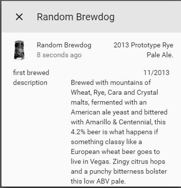

# Get info about a random beer

A platform which allows you to get information about a random BrewDog beer.

To get started put all the files from`/custom_components/brewdog/` here:
`<config directory>/custom_components/brewdog/`

**Example configuration.yaml:**

```yaml
sensor:
  platform: brewdog
```

**Configuration variables:**

key | description
:--- | :---
**platform (Required)** | The platform name.

## Sample overview




***

[](https://www.buymeacoffee.com/ludeeus)
